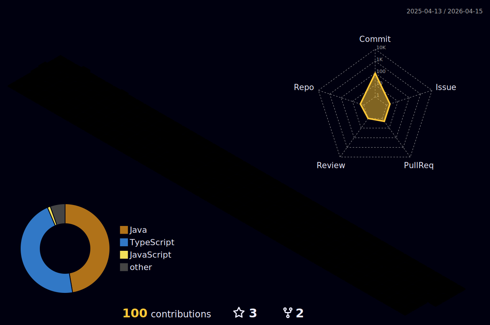

<h1 align="center">Hi 👋, I'm Vinícius Gonzaga</h1>
<h3 align="center">Software Engineering student looking for new knowledge every day</h3>

- 🔭 I’m currently working on [Crafting Code](https://github.com/viniciusg23/study-plataform)

- 🌱 I’m currently learning **TypeScript, Reactjs**

- 👨‍💻 All of my projects are available at [#commingsoon](#commingsoon)

- 💬 Ask me about **JavaScript and C any time**

- 📫 How to reach me **viniciusgonzagaguilherme@gmail.com**

- 📄 Know about my experiences [#commingsoon](#commingsoon)

- ⚡ Fun fact **I love football and video games 🏈🎮** 
 

---

<!-- connect with me section -->

  <ul align="center">
    
<h2 style="display: inline-block">Connect With Me 🤝</h2>

  </ul>

  

    
    
       
  

<!-- technologies session -->

  <ul align="center">
    
<h2 style="display: inline-block">Languages and Tools 🔧</h2>

  </ul>

  

