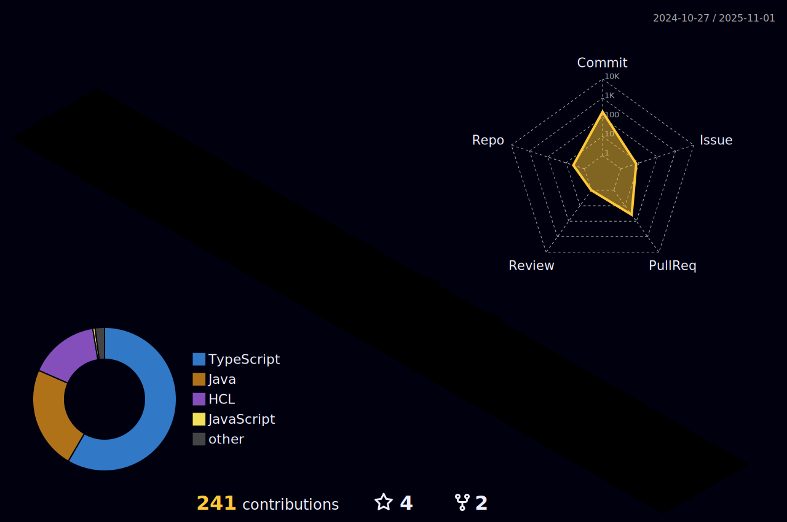

<h1 align="center">Hi 👋, I'm Vinícius Gonzaga</h1>
<h3 align="center">Software Engineering student looking for new knowledge every day</h3>

- 🔭 I’m currently working on [Productivity App](https://github.com/viniciusg23/productivity-app)

- 🌱 I’m currently learning **Spring Boot, React Native and Terraform**

- 💬 Ask me about **TypeScript and Java any time**

- 📫 How to reach me [Here](mailto:viniciusgonzagaguilherme@gmail.com)

- 📄 Know about my experiences <a href="https://viniicius.com" target="_blank">My Website</a>

- ⚡ Fun fact **I love football and video games 🏈🎮** 
 

<!-- connect with me section -->

  <ul>
    
<h2 style="display: inline-block">Connect With Me 🤝</h2>

  </ul>

  

    
    
       
  

<!-- technologies session -->

  <ul>
    
<h2 style="display: inline-block">Languages and Tools 🔧</h2>

  </ul>

  

-----

 Vinicius's Spotify Data

<table>
<tr>
 <td align="center" colspan="3"></td>
</tr> 
<tr>
<td>

</td>
<td>

</td>
<td>
<!--  -->

</td>
</tr>
<tr>
 <td align="center" colspan="3"></td>
</tr> 
</table>

